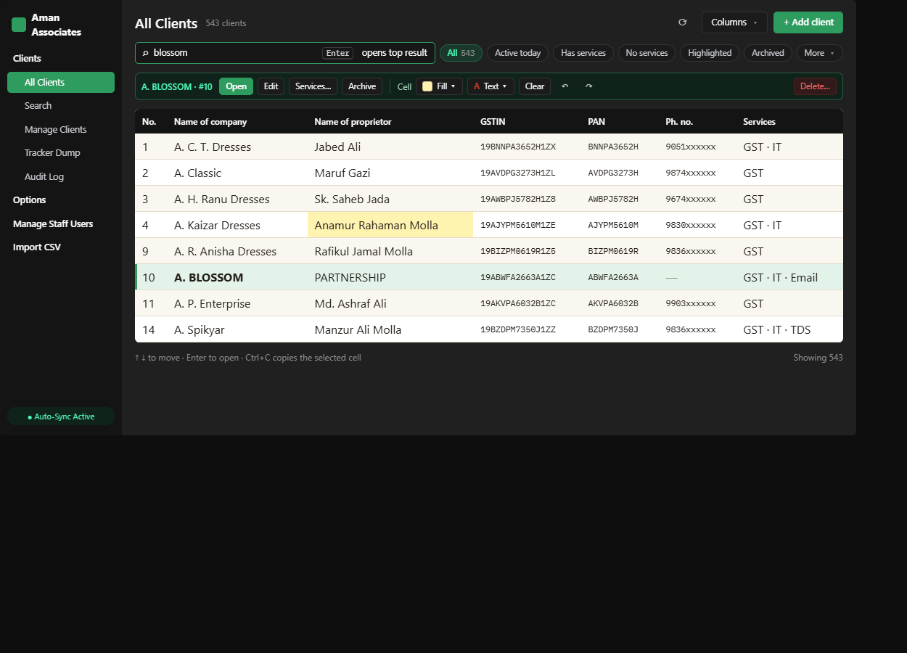

# All Clients / Search

Mockup only — nothing in the app has changed yet.

## What's wrong today

- **Cell formatting looks like page actions** — Fill, text colour, clear, undo and redo sit next to the page title, so they read as things the whole page does rather than tools for the selected cell.
- **Row actions are anonymous icons** — Edit, delete, services and archive are four unlabelled icons at the far right. Delete is red and visible all the time, even with nothing selected.
- **Columns run off the edge** — Company and proprietor take most of the width, so PH. NO. is cut off and you have to scroll sideways for the rest.
- **No sense of how many** — There's no count, and the filter is a plain dropdown where you can't tell at a glance that it's switched on.

## What changes

- Selection bar: the actions that need a selected client (Open, Edit, Services, Archive, Delete) and the cell-formatting tools only appear once a row or cell is selected. They're labelled, grouped as "client" and "cell", and Delete sits on its own at the far end.
- Header: title with a live count; Refresh, a new Columns ▾ menu (the same switches as Settings → Main Screen) and + Add client.
- Filters become chips, as on Manage Clients. The rarer presets (most viewed, has logins, missing passwords) go under More.
- Columns: names get a sensible share of the width instead of most of it, so PAN, phone and a Services column fit without sideways scrolling.

## Kept as it is

- The white grid, your cell highlights, keyboard navigation, and Enter opening the top result.
- Undo/redo still use Ctrl+Z / Ctrl+Y; the buttons just move next to the other cell tools.

## Where every current control goes

| Today | Redesign |
|---|---|
| Sidebar toggle | Unchanged (Ctrl+B) |
| Cell fill / text colour / clear formatting | "Cell" group in the selection bar |
| Undo / redo formatting | Same group, plus Ctrl+Z / Ctrl+Y |
| + Add Client, Refresh | Header, top right |
| Search box + Enter-opens hint | Search box; the hint moves into the box and the footer |
| Filter combo (9 presets) | Chips + More menu |
| Edit / Delete / Services / Archive icons | Labelled buttons in the selection bar |
