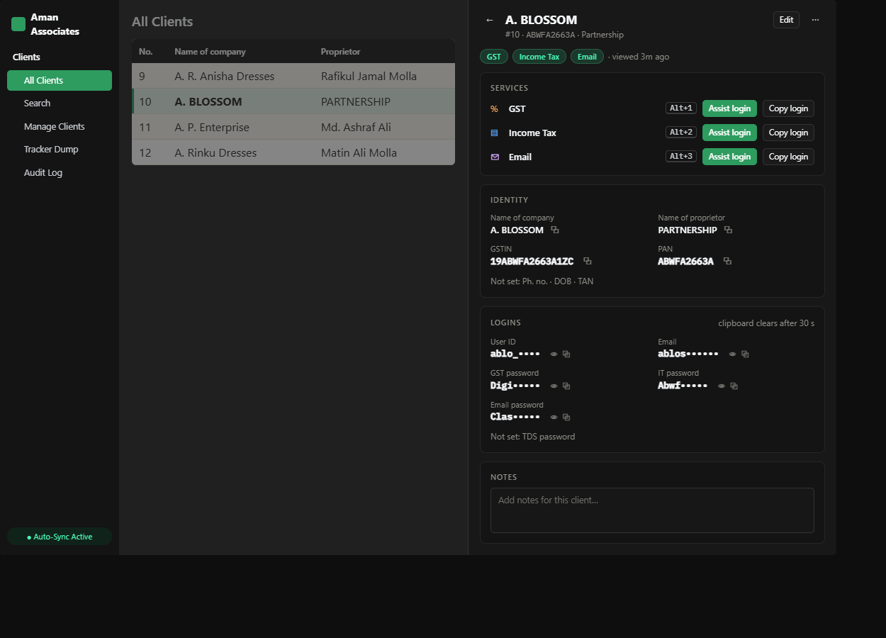

# Client detail panel

Mockup only — nothing in the app has changed yet.

## What's wrong today

- **Header wastes the one line that matters** — The proprietor ("PARTNERSHIP") is the subtitle and the ID chip floats off to the side. PAN and services aren't visible until you scroll.
- **Copy icons are far from what they copy** — Each copy icon sits at the far edge of its column, a long way from the value it copies.
- **Red buttons look like errors** — Every service has two red-outlined, unlabelled buttons. Red reads as "something is wrong", and the shortcut hint (Alt+1..9) doesn't say which key is which service.
- **Empty fields take up rows** — "Not set" appears four times, and Notes is squeezed into a one-line box at the bottom.

## What changes

- Header: name, then #ID · PAN · proprietor on one line, the attached services as pills, and the last activity. Edit is one click away.
- Services come first: they're the reason staff open this panel. Each row has labelled buttons ("Assist login", "Copy login") and its own Alt+number, so you can see which key is which.
- Copy icons sit right after the value they copy. Empty fields collapse into one "Not set: …" line.
- Notes gets a proper multi-line box.

## Colour rule

- Red is kept for danger (delete). The "OFF" state of Assist or Copy becomes a dimmed grey button with a tooltip explaining why it's off, instead of a red outline.
- Masking still follows Settings → Password Masking Mode (First N / Last N characters).

## Where every current control goes

| Today | Redesign |
|---|---|
| Back (Esc), name, CLI-00010 chip | Header: ← · name · #ID line |
| Identity fields with copy icons | Identity card; copy next to each value; empty ones listed on one line |
| Security credentials (masked) with show/copy | Logins card, same masking and 30 s clipboard clear |
| Services: Manual Assist + Manual Copy per service, Alt+1..9 | Services card with labelled buttons and a per-row Alt key |
| Notes (auto-saving) | Notes card, taller box, still saves automatically |
