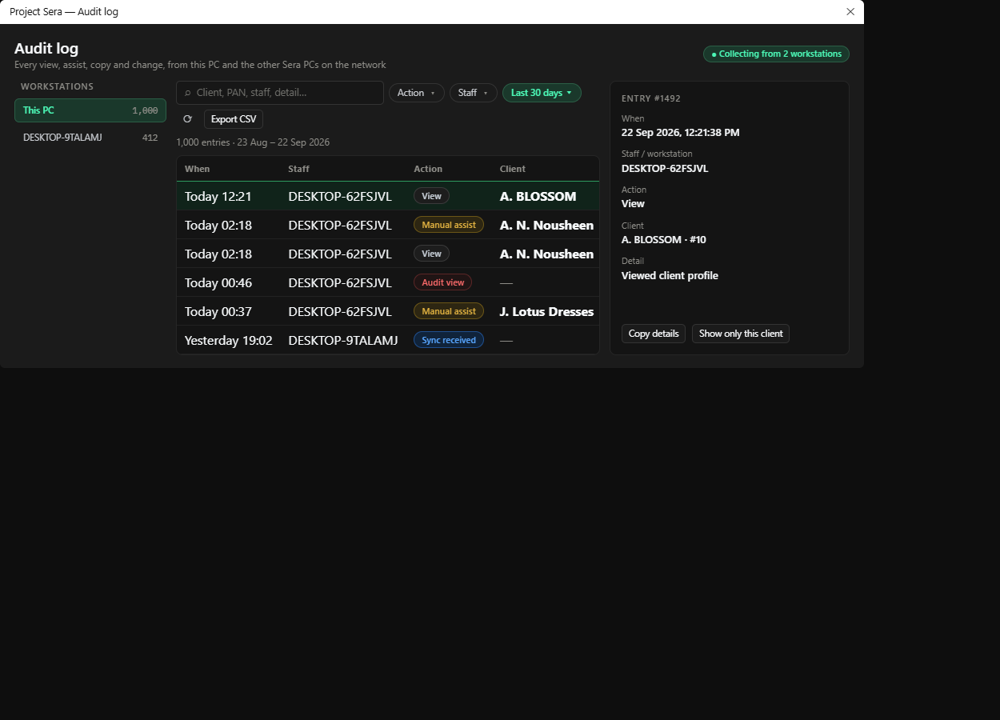

# Audit log (SSAL)

Mockup only — nothing in the app has changed yet.

## What's wrong today

- **Two rows of mismatched filters** — Search, Action, Staff, Refresh and Export sit on one row; the date preset, From and To sit on another, with different sizes and label styles.
- **Drill-down is a big empty box** — Half the dialog is an empty panel until you click a row. Its title is a boxed button that doesn't do anything.
- **Raw values leak through** — The Service column shows service numbers ("2", "1") instead of names, actors are cut to "DESKTOP-6…", and Detail is cut off.
- **Header chrome** — A boxed title and a large "Host Aggregator Active" button that is really just a status.

## What changes

- One filter row: search, then chips for Action, Staff and Date. The Date chip opens the presets (Today, Yesterday, 7 days, 30 days) with From/To underneath for a custom range.
- Details panel on the right with readable labels; it fills in when you pick a row, instead of a half-empty box below the table.
- Readable values: action names get coloured pills (views grey, assists amber, audit red, sync blue), service numbers become service names, and times read "Today 12:21" with the full time on hover.
- Workstation list shows how many entries each PC has.

## Kept as it is

- All 18 action types, the staff filter, custom date range, Export CSV, Refresh, Copy details and "Filter client" (now called "Show only this client").
- The aggregator state stays visible, just as a status pill rather than a button.

## Where every current control goes

| Today | Redesign |
|---|---|
| "Host Aggregator Active" + Close | Status pill; the window's own ✕ closes |
| Workstations list | Left column, with entry counts |
| Search, Action combo, Staff/Actor | Search box + Action and Staff chips |
| Date Range preset + From / To | Date chip (presets + custom From/To) |
| Refresh, Export CSV…, entry count | Right end of the filter row; count under it |
| Drill-down + Copy Details + Filter Client | Details panel on the right with both buttons |
