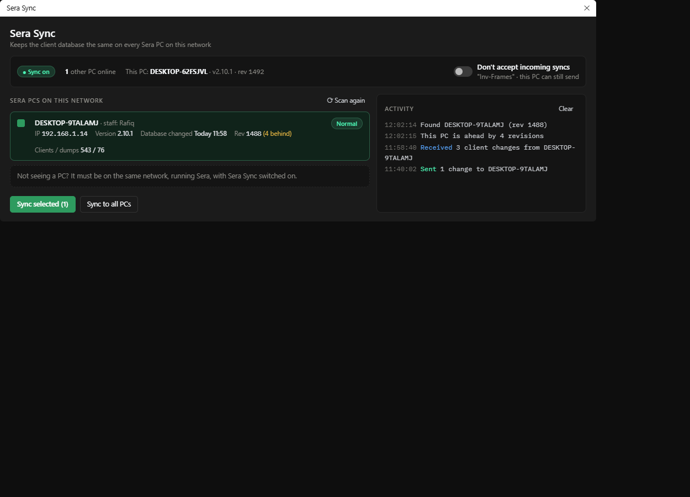

# Sera Sync

Mockup only — nothing in the app has changed yet.

## What's wrong today

- **A huge banner for one sentence** — The green status box takes a quarter of the window to say "LAN sync active".
- **The device table doesn't fit** — Eight columns squeezed into half the width: the headers are clipped ("erna", "stna") and it scrolls sideways. When empty, it's a blank white box with no explanation.
- **"Inv-Frames" is jargon** — A game term for a setting that stops this PC from accepting incoming syncs. You have to read the tooltip to learn what it does.
- **Three button colours** — Green, blue and dark buttons, with no clear primary action.

## What changes

- A one-line status strip replaces the banner: sync state, how many PCs are online, and this PC's name, version and revision.
- Inv-Frames becomes a plain switch named for what it does ("Don't accept incoming syncs"), with the old name underneath so it's still recognisable. The tooltip still explains the multi-PC freeze rule.
- Devices become cards, so all eight facts fit without sideways scrolling. The revision score also says whether that PC is ahead or behind. With no devices, the list explains what's needed.
- One primary button (Sync selected, with a count); Sync to all is secondary.

## Kept as it is

- Every column (username, hostname, IP, version, DB modified, rev score, clients/dumps, mode/status), Refresh, Clear and the live activity stream.

## Where every current control goes

| Today | Redesign |
|---|---|
| "N devices online" | Status strip |
| LAN SYNC ACTIVE banner | "Sync on" pill in the status strip |
| Inv-Frames: ON/OFF button | Switch in the status strip, same tooltip |
| 8-column device table | Device cards (all 8 facts), tick to select |
| Sync Selected / Sync To All / Refresh | Primary / secondary buttons; Refresh → "Scan again" |
| Live Sync Activity Stream + Clear | Activity card on the right |
| Close | The window's ✕ |
