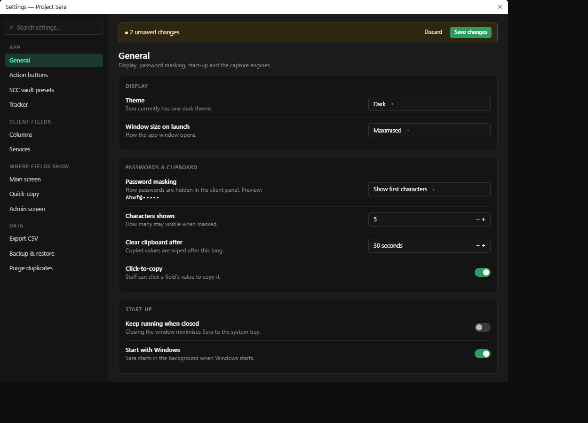

# Settings — General

Mockup only — nothing in the app has changed yet.

## What's wrong today

- **Checkboxes look like colour swatches** — The green squares on the right don't read as on/off switches.
- **Controls are all different widths** — Each dropdown and number box is a different width, so the right edge is ragged.
- **"Light Mode (Default)" on a dark app** — The theme setting says Light while everything is dark, which is confusing.
- **Save is easy to miss** — Save Changes is greyed out at the bottom, and nothing tells you that you've changed something.
- **Theme** — Sera currently has one dark theme.
- **Window size on launch** — How the app window opens.
- **Password masking** — How passwords are hidden in the client panel. Preview: Abwf@•••••
- **Characters shown** — How many stay visible when masked.
- **Clear clipboard after** — Copied values are wiped after this long.
- **Click-to-copy** — Staff can click a field's value to copy it.
- **Keep running when closed** — Closing the window minimises Sera to the system tray.
- **Start with Windows** — Sera starts in the background when Windows starts.

## What changes

- Real on/off switches instead of the green squares.
- Every control is the same width, so the right edge lines up.
- Grouped cards (Display, Passwords & clipboard, Start-up, Capture engines) instead of one long list with small section labels.
- Unsaved-changes bar at the top of the page with Discard and Save. It only appears once something has changed.
- Plainer wording ("Click-to-copy" instead of "Enable Quick-Copy — master toggle") and a live preview of the masking.

## To decide

- The theme setting: either hide it until a light theme exists, or show "Dark" as the only option. The mockup shows the second.
- The capture-engine rows (SDC DOM crosshair, SCA mode, SCA uses per UID) and Schema info move into their own card further down the same page; no setting is removed.
