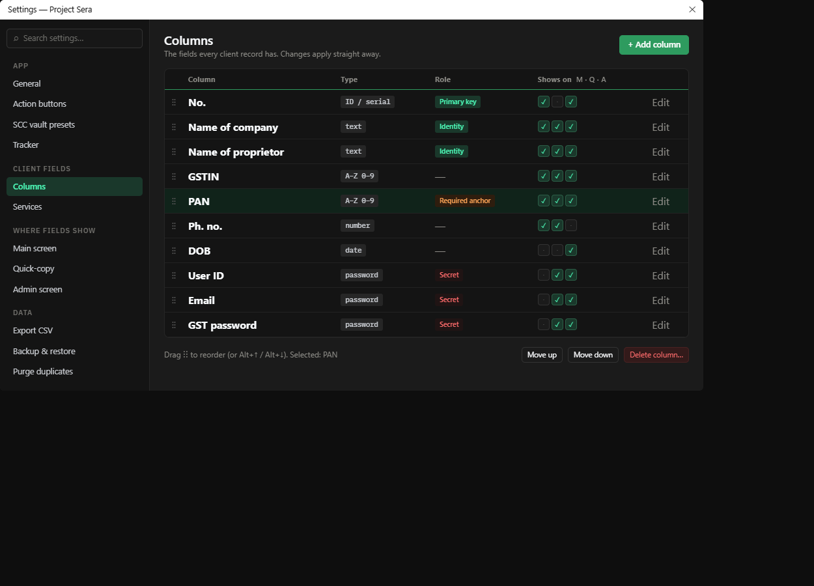

# Settings — Columns

Mockup only — nothing in the app has changed yet.

## What's wrong today

- **A text list pretending to be a table** — Type and flags are written as text ("(password) [Secret]"), so you can't scan down a column.
- **Unlabelled toolbar** — +, pencil, bin and arrows with no words, and the bin sits right next to edit.
- **Where a field shows is on other pages** — Whether a column appears on the main screen, in quick-copy or on the admin screen is set on three separate pages.
- **Odd empty space** — A large empty margin at the top, and the list doesn't use the full width.

## What changes

- A real table: Column · Type · Role · Shows on. Type and role become tags, so "which fields are secret?" can be answered at a glance.
- "Shows on" M · Q · A summarises the three visibility pages in one place. Clicking a tick switches it here, and the three pages stay for anyone who prefers them.
- Labelled actions: "+ Add column" at the top; Edit on each row; Move and Delete at the bottom for the selected row, with Delete set apart.

## Something I noticed

- In your screenshot, EMAIL and TAN are set to type password [Secret]. TAN in particular is usually treated like PAN (an identifier, not a secret). If that wasn't intended, it's a one-click change here. The mockup leaves it as it is.
