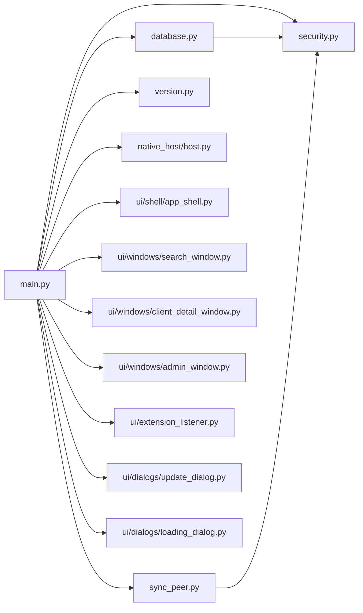
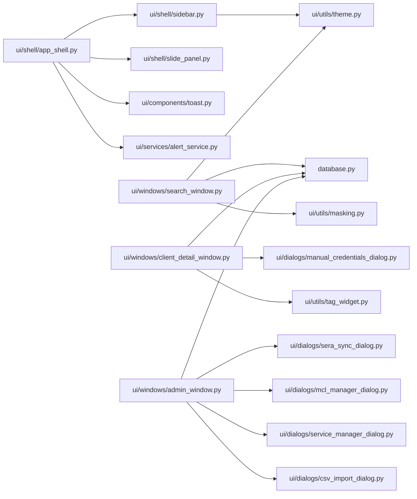
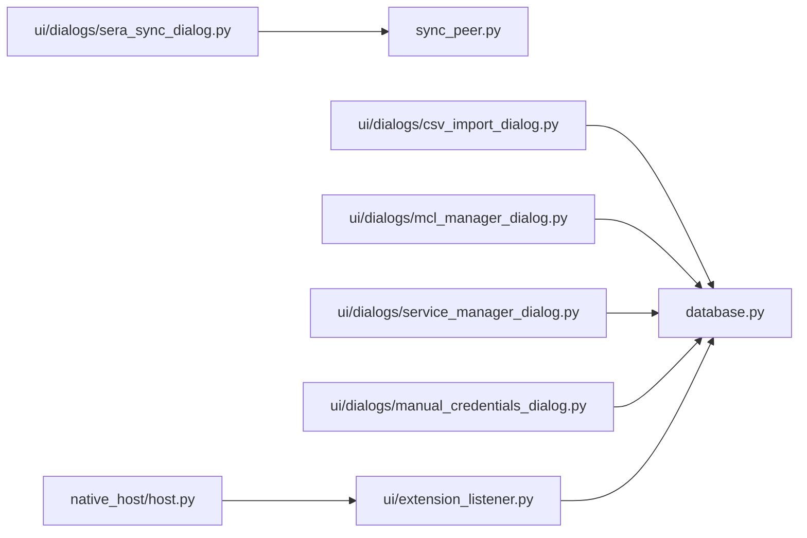
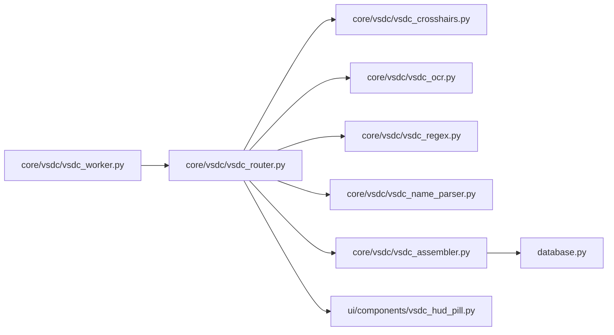

# Project Sera — Codebase Architecture & Node Representation

This document provides a visual and structural node representation mapping how every Python module and configuration component in the **Project Sera** application connects to one another.

---

## 1. Subsystem Architecture Overview

```mermaid
graph TD
    classDef entrypoint fill:#164A68,stroke:#4CF9B7,stroke-width:2px,color:#FFFFFF;
    classDef core fill:#1E293B,stroke:#38BDF8,stroke-width:1.5px,color:#FFFFFF;
    classDef shell fill:#0F172A,stroke:#F59E0B,stroke-width:1.5px,color:#FFFFFF;
    classDef page fill:#111827,stroke:#10B981,stroke-width:1.5px,color:#FFFFFF;
    classDef dialog fill:#1F2937,stroke:#A855F7,stroke-width:1.5px,color:#FFFFFF;
    classDef native fill:#331E38,stroke:#EC4899,stroke-width:1.5px,color:#FFFFFF;

    subgraph Entry & Core Systems
        MAIN["main.py<br/><i>(App Entrypoint & Signal Bridge)</i>"]:::entrypoint
        DB["database.py<br/><i>(SQLCipher Vault & Schema)</i>"]:::core
        SEC["security.py<br/><i>(PBKDF2 / Salt / Argon2)</i>"]:::core
        SYNC["sync_peer.py<br/><i>(LAN UDP/TCP Peer Sync)</i>"]:::core
        VER["version.py<br/><i>(GitHub Auto-Updater)</i>"]:::core
        CLIP_WATCH["clipboard_watch.py<br/><i>(SCA Ambient Listener)</i>"]:::core
    end

    subgraph Shell & Layout
        SHELL["ui/shell/app_shell.py<br/><i>(Main Window Shell)</i>"]:::shell
        SIDEBAR["ui/shell/sidebar.py<br/><i>(Navigation & Profile)</i>"]:::shell
        SLIDE["ui/shell/slide_panel.py<br/><i>(Animated Detail Drawer)</i>"]:::shell
    end

    subgraph Main Windows
        SEARCH["ui/windows/search_window.py<br/><i>(Client Search & Formatting Grid)</i>"]:::page
        DETAIL["ui/windows/client_detail_window.py<br/><i>(Client Workspace & FST)</i>"]:::page
        ADMIN["ui/windows/admin_window.py<br/><i>(Admin Management)</i>"]:::page
        TRACKER_DUMP["ui/windows/tracker_dump_window.py<br/><i>(Tracker Dump & Status Badges)</i>"]:::page
    end

    subgraph Dialogs & Modals
        SYNC_DLG["ui/dialogs/sera_sync_dialog.py<br/><i>(Sera Sync LAN Panel)</i>"]:::dialog
        MCL_DLG["ui/dialogs/mcl_manager_dialog.py<br/><i>(Column Manager)</i>"]:::dialog
        SVC_DLG["ui/dialogs/service_manager_dialog.py<br/><i>(Service Manager)</i>"]:::dialog
        CSV_DLG["ui/dialogs/csv_import_dialog.py<br/><i>(CSV Import Mapper)</i>"]:::dialog
        UPD_DLG["ui/dialogs/update_dialog.py<br/><i>(Update Progress Modal)</i>"]:::dialog
        LOAD_DLG["ui/dialogs/loading_dialog.py<br/><i>(Vault Unlock Modal)</i>"]:::dialog
        CRED_DLG["ui/dialogs/manual_credentials_dialog.py<br/><i>(Credential Editor)</i>"]:::dialog
        SETTINGS_DLG["ui/dialogs/unified_settings_dialog.py<br/><i>(Unified Settings Hub)</i>"]:::dialog
        AI_DLG["ui/dialogs/ai_settings_dialog.py<br/><i>(Gemini AI Settings)</i>"]:::dialog
    end

    subgraph Native Host & Browser Extension
        NH_HOST["native_host/host.py<br/><i>(Chrome Native Messaging Host)</i>"]:::native
        EXT_LISTEN["ui/extension_listener.py<br/><i>(Extension Socket Server)</i>"]:::native
        SDC_CORE["sera_extension/sdc/sdc_core.js<br/><i>(SDC Route Gater & Assembler)</i>"]:::native
        SDC_PROTO["sera_extension/sdc/protocols/*<br/><i>(ITR & GST Crosshair Protocols)</i>"]:::native
    end

    subgraph VSDC & VSDC-X Harvester
        VSDC_WORKER["core/vsdc/vsdc_worker.py<br/><i>(Frame Cropper & Worker)</i>"]:::core
        VSDC_ROUTER["core/vsdc/vsdc_router.py<br/><i>(UIA Route Gater & Dual Pipeline)</i>"]:::core
        VSDC_UIA["core/vsdc/vsdc_uia_text.py<br/><i>(VSDC-X UIA Exact Text Engine)</i>"]:::core
        VSDC_ASSEMBLER["core/vsdc/vsdc_assembler.py<br/><i>(Multi-Screen Session Assembler)</i>"]:::core
        VSDC_OCR["core/vsdc/vsdc_ocr.py<br/><i>(DirectML Windows.Media.Ocr)</i>"]:::core
        VSDC_REGEX["core/vsdc/vsdc_regex.py<br/><i>(Statutory Tax Regex & Repair)</i>"]:::core
        VSDC_NAME["core/vsdc/vsdc_name_parser.py<br/><i>(Authoritative Legal Name Engine)</i>"]:::core
        VSDC_BEEPER["core/vsdc/vsdc_beeper.py<br/><i>(Zero-Leakage PAN Audio Beeper)</i>"]:::core
        VSDC_GEMINI["core/vsdc/vsdc_gemini_parser.py<br/><i>(Gemini Flash AI Structured Parser)</i>"]:::core
        VSDC_TOKEN["core/vsdc/vsdc_token_tracker.py<br/><i>(Gemini Token & Cost Meter)</i>"]:::core
        VSDC_LOGGER["core/vsdc/vsdc_session_logger.py<br/><i>(VSDC Session Diagnostic Logger)</i>"]:::core
        VSDC_HUD["ui/components/vsdc_hud_pill.py<br/><i>(Ambient HUD Pill Overlay)</i>"]:::shell
    end

    %% Connections
    MAIN --> DB
    MAIN --> SEC
    MAIN --> SYNC
    MAIN --> VER
    MAIN --> CLIP_WATCH
    MAIN --> SHELL
    MAIN --> SEARCH
    MAIN --> DETAIL
    MAIN --> ADMIN
    MAIN --> TRACKER_DUMP
    MAIN --> EXT_LISTEN
    MAIN --> NH_HOST
    MAIN --> VSDC_WORKER

    VSDC_WORKER --> VSDC_ROUTER
    VSDC_ROUTER --> VSDC_UIA
    VSDC_ROUTER --> VSDC_OCR
    VSDC_ROUTER --> VSDC_REGEX
    VSDC_ROUTER --> VSDC_NAME
    VSDC_ROUTER --> VSDC_BEEPER
    VSDC_ROUTER --> VSDC_LOGGER
    VSDC_ROUTER --> VSDC_ASSEMBLER
    VSDC_ROUTER --> VSDC_HUD
    VSDC_ASSEMBLER --> VSDC_GEMINI
    VSDC_GEMINI --> VSDC_TOKEN
    VSDC_ASSEMBLER --> DB

    DB --> SEC
    SYNC --> SEC

    SHELL --> SIDEBAR
    SHELL --> SLIDE

    ADMIN --> SYNC_DLG
    ADMIN --> MCL_DLG
    ADMIN --> SVC_DLG
    ADMIN --> CSV_DLG
    SETTINGS_DLG --> AI_DLG

    DETAIL --> CRED_DLG
    VER --> UPD_DLG
```



---

## 2. Detailed File-to-File Dependency Matrix

### Core & Application Controller Layer



---

### UI Shell & Window Routing Layer



---

### Dialog & Extension Interop Layer



---

### VSDC Optical Harvester Layer



---

## 3. Component Responsibility Reference

| Module Path | Primary Class / Functions | Connected Dependencies | Responsibility |
|---|---|---|---|
| [`main.py`](file:///c:/Users/Nex/Downloads/Project%20Sera/APP/main.py) | `SeraApp`, `SyncSignalBridge` | `database`, `security`, `sync_peer`, `version`, `app_shell`, `windows/*` | Application entrypoint, vault initialization, Qt signal bridging, auto-updater trigger, window routing. |
| [`database.py`](file:///c:/Users/Nex/Downloads/Project%20Sera/APP/database.py) | `SeraDatabase`, `DatabaseError` | `security` | SQLCipher database CRUD, master column layout (MCL), cell formatting, audit logging, backup/restore, Syncthing/peer conflict matching. |
| [`security.py`](file:///c:/Users/Nex/Downloads/Project%20Sera/APP/security.py) | `derive_key_hex`, `load_salt`, `verify_pin` | Python standard crypto libraries | PBKDF2 key derivation, salt generation/loading, Argon2id PIN verification. |
| [`sync_peer.py`](file:///c:/Users/Nex/Downloads/Project%20Sera/APP/sync_peer.py) | `SyncPeerService`, `PeerInfo` | `main` | Zero-configuration UDP LAN peer discovery (`BEACON_PORT 49156`) & TCP raw database/salt push (`SYNC_PORT 49157`). |
| [`clipboard_watch.py`](file:///c:/Users/Nex/Downloads/Project%20Sera/APP/clipboard_watch.py) | `ClipboardWatchService` | `QClipboard`, `database` | SCA event-driven ambient clipboard watcher matching copied UIDs against memory index for zero-touch autofill. |
| [`core/vsdc/vsdc_uia_text.py`](file:///c:/Users/Nex/Downloads/Project%20Sera/APP/core/vsdc/vsdc_uia_text.py) | `read_page_text`, `is_available` | `comtypes`, `UIAutomationCore.dll` | VSDC-X direct UI Automation sensor reading exact text tree from Chromium accessibility nodes with ValuePattern support. |
| [`core/vsdc/vsdc_router.py`](file:///c:/Users/Nex/Downloads/Project%20Sera/APP/core/vsdc/vsdc_router.py) | `VsdcRouter`, `_WindowSession` | `vsdc_crosshairs`, `vsdc_uia_text`, `vsdc_ocr`, `vsdc_regex`, `vsdc_assembler` | Windows UIA browser URL inspection, dual-pipeline sensor routing (UIA first, OCR fallback), and window-isolated session tracking. |
| [`core/vsdc/vsdc_assembler.py`](file:///c:/Users/Nex/Downloads/Project%20Sera/APP/core/vsdc/vsdc_assembler.py) | `VsdcAssembler` | `database`, `vsdc_gemini_parser` | Multi-screen taxpayer session buffering, statutory filing type tracking, Ack validation, and dataset emission. |
| [`core/vsdc/vsdc_name_parser.py`](file:///c:/Users/Nex/Downloads/Project%20Sera/APP/core/vsdc/vsdc_name_parser.py) | `extract_clean_client_name` | `re` | Normalizes text, strips web ligatures and portal noise, prioritizes authoritative legal names over truncated header pill badges. |
| [`core/vsdc/vsdc_regex.py`](file:///c:/Users/Nex/Downloads/Project%20Sera/APP/core/vsdc/vsdc_regex.py) | Regex parsers & repair | `re` | Validates PAN, GSTIN, Ack numbers; extracts form headings, statutory filing types (`Original`, `Revised`, `Belated`, `Updated u/s 139(8A)`), and contact info. |
| [`core/vsdc/vsdc_ocr.py`](file:///c:/Users/Nex/Downloads/Project%20Sera/APP/core/vsdc/vsdc_ocr.py) | `VsdcOcrEngine` | `winsdk.windows.media.ocr` | Hardware-accelerated offline DirectML OCR via native Windows 10/11 runtime. |
| [`core/vsdc/vsdc_beeper.py`](file:///c:/Users/Nex/Downloads/Project%20Sera/APP/core/vsdc/vsdc_beeper.py) | `PanBeeper` | `winsound` | Zero-leakage audible feedback tone upon client PAN detection without transmitting any data. |
| [`core/vsdc/vsdc_gemini_parser.py`](file:///c:/Users/Nex/Downloads/Project%20Sera/APP/core/vsdc/vsdc_gemini_parser.py) | `parse_compliance_with_gemini` | `google-genai` | Pre-dump Gemini Flash AI compliance parser converting complex return tables to structured JSON with Privacy Guard. |
| [`core/vsdc/vsdc_token_tracker.py`](file:///c:/Users/Nex/Downloads/Project%20Sera/APP/core/vsdc/vsdc_token_tracker.py) | `GeminiTokenTracker` | `json` | Tracks input/output tokens and estimated API costs, persisting metrics to user profile. |
| [`core/vsdc/vsdc_session_logger.py`](file:///c:/Users/Nex/Downloads/Project%20Sera/APP/core/vsdc/vsdc_session_logger.py) | `log_vsdc_capture` | `os` | Diagnostic session capture logger writing debug text files to user profile `Vsdc_Captures\`. |
| [`core/vsdc/vsdc_worker.py`](file:///c:/Users/Nex/Downloads/Project%20Sera/APP/core/vsdc/vsdc_worker.py) | `VsdcWorker` | `QThread`, `vsdc_router` | Background polling loop executing non-blocking frame ticks against active browser windows. |
| [`ui/components/vsdc_hud_pill.py`](file:///c:/Users/Nex/Downloads/Project%20Sera/APP/ui/components/vsdc_hud_pill.py) | `VsdcHudPill` | `QWidget`, `QPainter` | Floating frameless HUD Pill displaying live client identity, filing confirmations, and source tags (`[VSDC-X]` vs `[VSDC]`). |
| [`ui/dialogs/ai_settings_dialog.py`](file:///c:/Users/Nex/Downloads/Project%20Sera/APP/ui/dialogs/ai_settings_dialog.py) | `AISettingsDialog`, `GeminiSettingsDialog` | `database` | Configuration interface for Gemini API keys, model selection, token budget, and structured parsing rules. |
| [`ui/shell/app_shell.py`](file:///c:/Users/Nex/Downloads/Project%20Sera/APP/ui/shell/app_shell.py) | `AppShell` | `sidebar`, `slide_panel`, `toast`, `alert_service` | Main application shell frame, tab switcher blur effects, notification alert queue. |
| [`ui/shell/sidebar.py`](file:///c:/Users/Nex/Downloads/Project%20Sera/APP/ui/shell/sidebar.py) | `Sidebar` | `theme` | Left navigation bar, admin mode toggle, profile row with Sera Sync trigger. |
| [`ui/shell/slide_panel.py`](file:///c:/Users/Nex/Downloads/Project%20Sera/APP/ui/shell/slide_panel.py) | `SlidePanel` | Qt animation framework | Smooth sliding drawer component for viewing client details over search results. |
| [`ui/windows/search_window.py`](file:///c:/Users/Nex/Downloads/Project%20Sera/APP/ui/windows/search_window.py) | `SearchWindow` | `database`, `masking` | Global client search, quick copy columns, tabular formatting grid & toolbar, client action shortcuts. |
| [`ui/windows/client_detail_window.py`](file:///c:/Users/Nex/Downloads/Project%20Sera/APP/ui/windows/client_detail_window.py) | `ClientDetailWindow` | `database`, `manual_credentials_dialog` | Full client profile workspace, credentials, File Submission Tracker (FST) status & actions. |
| [`ui/windows/admin_window.py`](file:///c:/Users/Nex/Downloads/Project%20Sera/APP/ui/windows/admin_window.py) | `AdminWindow` | `database`, `sera_sync_dialog`, `mcl_manager_dialog`, `service_manager_dialog`, `csv_import_dialog` | System administration panel for MCL, CSV operations, backup/restore, and launching Sera Sync. |
| [`ui/dialogs/sera_sync_dialog.py`](file:///c:/Users/Nex/Downloads/Project%20Sera/APP/ui/dialogs/sera_sync_dialog.py) | `SeraSyncDialog` | `sync_peer` | Admin modal dialog displaying online LAN peers and executing database push actions. |
| [`native_host/host.py`](file:///c:/Users/Nex/Downloads/Project%20Sera/APP/native_host/host.py) | `main` | Chrome Native Messaging API | Binary STDIN/STDOUT native host bridge forwarding credentials to Chrome/Edge extension. |
| [`ui/extension_listener.py`](file:///c:/Users/Nex/Downloads/Project%20Sera/APP/ui/extension_listener.py) | `ExtensionListener` | `database` | Local socket server listening for extension auto-fill requests and logging audit actions. |
| [`build_tools/build_package.py`](file:///c:/Users/Nex/Downloads/Project%20Sera/APP/build_tools/build_package.py) | Automated script | PyInstaller, spec file, CRX packer | Bundles executable directory (`package_dist/Amas_Sera`) and packages Chrome extension `.crx`. |
| [`build_tools/installer_setup.iss`](file:///c:/Users/Nex/Downloads/Project%20Sera/APP/build_tools/installer_setup.iss) | Inno Setup script | `package_dist/Amas_Sera` | Compiles single-file Windows setup installer (`Amas_Sera_Setup_vX.X.X.X.exe`). |

---

## 4. Key Execution & Data Flow Patterns

### A. Application Initialization & Vault Unlock
```
main.py ──> security.load_salt() ──> security.derive_key_hex() ──> database.SeraDatabase() ──> app_shell.py
```

### B. LAN Database Synchronization (Sera Sync)
```
[Sender] admin_window.py ──> sera_sync_dialog.py ──> sync_peer.push_to()
                                                            │ (TCP port 49157)
                                                            ▼
[Receiver] sync_peer._handle_incoming_push() ──> main.SyncSignalBridge ──> main._lock_and_force_restart()
```

### C. Browser Extension Credentials Injection & FST Capture
```
Chrome/Edge Extension ──(Native Messaging STDIN)──> native_host/host.py ──(Socket)──> ui/extension_listener.py ──> database.py
```

### D. VSDC / VSDC-X Zero-Browser Optical & Exact-Text Session Capture
```
Browser Window ──(UIA Address Bar)──> vsdc_worker.py ──> vsdc_router.py (Crosshair Gate)
                                                               │
                                  ┌────────────────────────────┴────────────────────────────┐
                                  ▼                                                         ▼
                       Primary: vsdc_uia_text.py                               Fallback: vsdc_ocr.py
                       (UIA Chromium Exact Text Tree)                          (Windows.Media.Ocr DirectML)
                                  │                                                         │
                                  └────────────────────────────┬────────────────────────────┘
                                                               ▼
                                                       vsdc_regex.py / vsdc_name_parser.py
                                                       (Statutory Regex, Form Headings & Filing Types)
                                                               │
                                                               ▼
                                                       vsdc_assembler.py
                                                               │
                                  ┌────────────────────────────┴────────────────────────────┐
                                  ▼                                                         ▼
                           VsdcHudPill (UI)                                        database.tracker_dump
                           (Pulse on capture; [VSDC-X] tag)                        (SQLite rawPayload.db)
```
