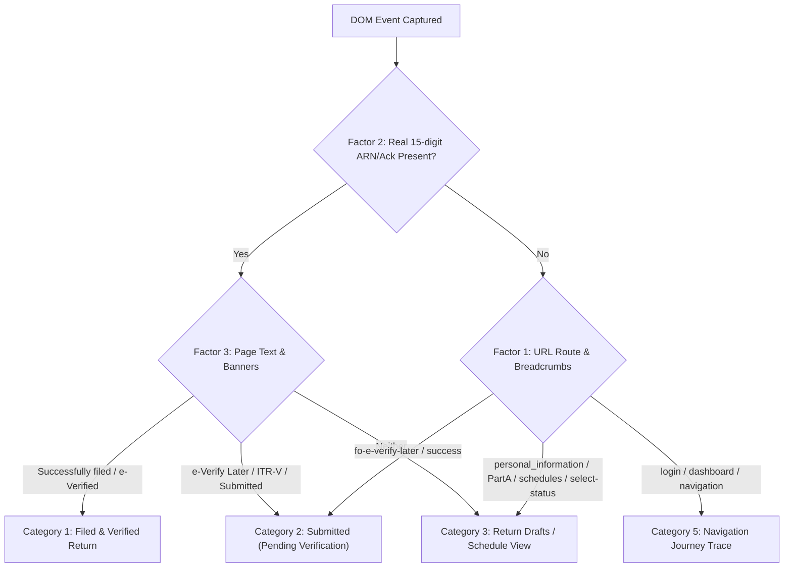

# DOM Parser 1 (`DOM_Parser_1`) Guide

**DOM Parser 1** is an offline-first analytical classification and audit reporting subsystem for **Project Sera**. It is specialized for the **Sera DOM Tracker** visual observation pipeline.

---

## 1. Overview & Architecture

While **FST Classifier 1** (`FST_Classifier_1`) operates on intercepted network API payloads, **DOM Parser 1** (`DOM_Parser_1`) analyzes visual DOM snapshots (`scraped_data`), reconstructing statutory workflows from rendered HTML.

```
+-------------------------------------------------------------------+
| Visual DOM Layer (Browser Extension tracker.js)                   |
| - Visible form inputs (FirstName, MiddleName, SurName, PAN)       |
| - Visible summary cards (Legal Name, Trade Name, GSTIN, Status)   |
| - Visible breadcrumbs (Dashboard > e-File > ITR-3 > Part A)       |
+---------------------------------+---------------------------------+
                                  |
                                  v
+-------------------------------------------------------------------+
| SQLite Database (`rawPayload.db`) / Text Dump (`seraRaw...txt`)   |
+---------------------------------+---------------------------------+
                                  |
                                  v
+-------------------------------------------------------------------+
| DOM_PARSER_1 ENGINE (`DOM_Parser_1/dom_parser.py`)                |
| - Bi-Directional Identity Stitching (Forward & Backward Sweep)    |
| - 3-Factor Multi-Signal Classification Matrix                     |
| - Entity-Centric Reconciliation (`entities[pan]`)                 |
+---------------------------------+---------------------------------+
                                  |
                                  v
+-------------------------------------------------------------------+
| Multi-Tab Formatted Excel Workbook (`dom_audit_report.xlsx`)      |
+-------------------------------------------------------------------+
```

---

## 2. Pinpoint Classification Engine

DOM Parser 1 avoids false positives (such as classifying login or status-selection screens as submissions) by fusing **3 simultaneous signals**:



### 3-Factor Multi-Signal Rules:
1. **Factor 1: Route & URL Context:**
   * Return success routes (`fo-return-success`, `fo-e-verify-later`) are strictly isolated from draft forms (`personal_information`, `parta`, `select-status`) and general navigation (`login`, `dashboard`).
2. **Factor 2: 15-Digit Statutory Ack / ARN:**
   * Validates real numeric acknowledgement numbers, rejecting word fragments or UI text.
3. **Factor 3: Rendered Page Banners & Confirmation Text:**
   * Inspects visual banner text for exact lifecycle indicators (`"successfully filed"`, `"verified successfully"`, `"e-Verify Later"`, `"Download ITR-V"`).

---

## 3. Bi-Directional Identity Stitching Algorithm

When an assessee logs in and navigates the portal, early setup screens (`login`, `select-status`) often load *before* the taxpayer's name or PAN is rendered on screen.

* **Forward Carry:** Once a PAN is seen, it applies forward to subsequent entries in the same session.
* **Backward Carry:** When the assessee's name (`ARIF MOHAMMAD MOLLA`) and PAN (`CJLPM0265M`) are revealed in `Part A General`, the engine automatically walks **backwards** up the timeline to retroactively link leading `login` and `wizard` entries.
* *Result:* Zero orphaned `UNKNOWN` or unlinked entries in the journey trace.

---

## 4. Five Lifecycle Excel Categories

1. 🟢 **Sheet 1: Filed & Verified Returns**
   * Filings with an authentic 15-digit Ack Number and confirmed e-Verification banner (`"successfully filed"`).
2. 🟡 **Sheet 2: Submitted (Pending e-Verification)**
   * Submissions where filing completed and 30-day ITR-V was generated (`fo-e-verify-later`, `"Download ITR-V"`).
3. 🔵 **Sheet 3: Active Return Drafts & Tax Schedules**
   * Schedules, `PartA_GEN`, computation tables, and outward supply forms being prepared.
4. 🟣 **Sheet 4: Taxpayer Identity Ledger**
   * Master ledger of unique taxpayers (PAN / GSTIN / Reconciled Legal Names) with observed forms and capture counts.
5. ⚪ **Sheet 5: User Navigation Journey Trace**
   * Full chronological clickstream audit trail reconstructed from `site_link_history` and `dom_breadcrumbs`.

---

## 5. Usage & Execution

### Windows One-Click
Double-click [`DOM_Parser_1/run.bat`](file:///c:/Users/Nex/Downloads/Project%20Sera/APP/DOM_Parser_1/run.bat) to launch the live auto-refresh watcher.

### Command Line Interface
```powershell
# Single run against SQLite database
python dom_parser.py "..\rawPayload.db" "dom_audit_report.xlsx"

# Continuous watch mode
python dom_parser.py "..\rawPayload.db" "dom_audit_report.xlsx" --watch
```

### Desktop UI Integration
In Project Sera:
1. Open the **Tracker Dump Window** (FST / DOM Dump manager).
2. Click **Preferences / Options** menu (⚙️).
3. Select **"DOM Parser 1 (Excel Report)"** to instantly generate and launch `dom_audit_report.xlsx`.
