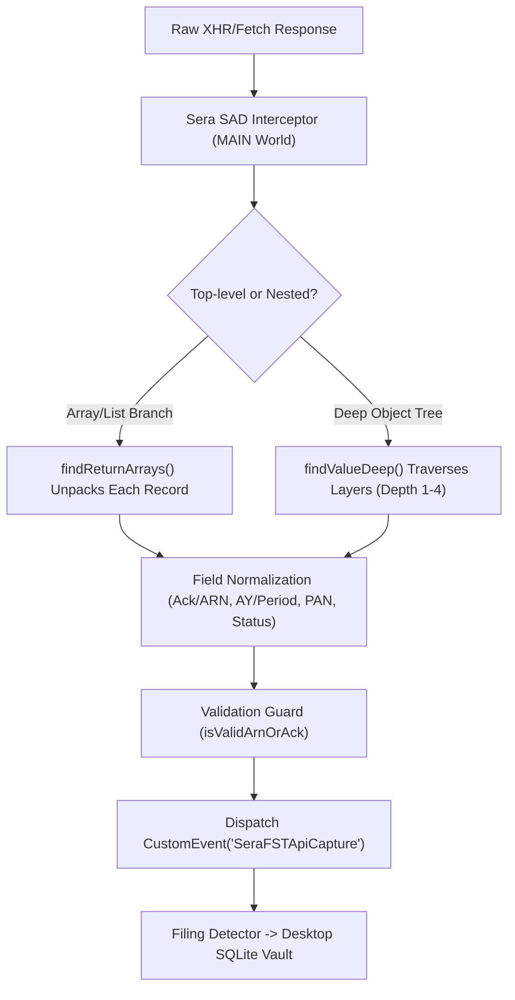

# Government Tax Portals — API Payload & Interception Matrix

This document provides a comprehensive technical reference of the backend REST API endpoints, trigger actions, **multi-layer nested JSON response payloads**, and **Sera SAD (API Detector)** deep extraction mappings across all supported government tax and statutory portals.

---

## Table of Contents
1. [Architecture: Multi-Layer Deep Traversal Engine](#architecture-multi-layer-deep-traversal-engine)
2. [Income Tax Department (ITD 2.0)](#1-income-tax-department-itd-20)
   - [1.1 ITR Return Submission (ITR 1–7)](#11-itr-return-submission-itr-17)
   - [1.2 ITR E-Verification (OTP / EVC / DSC)](#12-itr-e-verification-otp--evc--dsc)
   - [1.3 View Filed Returns & Multi-Year Dashboard (`getEntity`)](#13-view-filed-returns--multi-year-dashboard-getentity)
   - [1.4 Statutory Forms Filing (Form 10-IEA, 10BA, 29B, 15CA/CB, 35)](#14-statutory-forms-filing-form-10-iea-10ba-29b-15cacb-35)
   - [1.5 Rectification Request (Section 154) & Condonation](#15-rectification-request-section-154--condonation)
   - [1.6 Response to Outstanding Demand & Assessment Orders](#16-response-to-outstanding-demand--assessment-orders)
   - [1.7 e-Pay Tax Challan & Payment Confirmation (CRN / CIN)](#17-e-pay-tax-challan--payment-confirmation-crn--cin)
3. [GST Portal (Goods & Services Tax Network)](#2-gst-portal-goods--services-tax-network)
   - [2.1 GSTR-1 Return Filing (Multi-Table Inward/Outward)](#21-gstr-1-return-filing-multi-table-inwardoutward)
   - [2.2 GSTR-3B Return Filing & Tax Offset Envelope](#22-gstr-3b-return-filing--tax-offset-envelope)
   - [2.3 CMP-08 Quarterly Composition Statement](#23-cmp-08-quarterly-composition-statement)
   - [2.4 Payment Challan Generation (PMT-06 CPIN Envelope)](#24-payment-challan-generation-pmt-06-cpin-envelope)
   - [2.5 GST Registration & Amendment (REG-01 / REG-14 / REG-21)](#25-gst-registration--amendment-reg-01--reg-14--reg-21)
   - [2.6 Refund Application (RFD-01 Multi-Head Ledger)](#26-refund-application-rfd-01-multi-head-ledger)
   - [2.7 Track Return Status & Filing History](#27-track-return-status--filing-history)
4. [TRACES Portal (TDS CPC)](#3-traces-portal-tds-cpc)
   - [3.1 Consolidated TDS File Request (Conso File)](#31-consolidated-tds-file-request-conso-file)
   - [3.2 Justification Report Request](#32-justification-report-request)
   - [3.3 Form 16 / 16A Bulk Certificate Download](#33-form-16--16a-bulk-certificate-download)
5. [MCA V3 (Ministry of Corporate Affairs)](#4-mca-v3-ministry-of-corporate-affairs)
   - [4.1 Annual Company Filing (AOC-4, MGT-7, DIR-3 KYC)](#41-annual-company-filing-aoc-4-mgt-7-dir-3-kyc)

---

## Architecture: Multi-Layer Deep Traversal Engine

Government portal backends consistently wrap responses inside multi-tier envelopes (`serviceResponse`, `envelope`, `data`, `entityList`, `taxPayerDetails`). 

Sera SAD (`net_interceptor.js`) uses recursive object-graph traversal:
- **`findValueDeep(obj, targetKeys, maxDepth=4)`**: Recursively searches JSON trees across multiple nested dictionary branches without requiring brittle hardcoded property paths.
- **`findReturnArrays(obj, maxDepth=4)`**: Locates all embedded lists of records (e.g. multi-year filing histories, array of filed forms) and maps each element individually into Sera's Filing Submissions Tracker.



---

## 1. Income Tax Department (ITD 2.0)
**Base Host**: `https://eportal.incometax.gov.in`

### 1.1 ITR Return Submission (ITR 1–7)
* **Trigger Action**: Clicking **"Submit"** or uploading completed JSON on the e-File ITR screen.
* **API Endpoint**: `POST /iec/foservices/api/itr/submit`
* **Multi-Layer Server Response Payload**:
```json
{
  "status": "SUCCESS",
  "httpStatusCode": 200,
  "serviceResponse": {
    "header": {
      "transactionId": "TXN_ITR_98127391283",
      "timestamp": "2026-08-23T14:02:11.120Z",
      "serviceName": "ITR_FILING_SERVICE"
    },
    "body": {
      "filingSummary": {
        "acknowledgementDetails": {
          "acknowledgementNumber": "827916720300726",
          "submissionDate": 1721644800000,
          "verificationMode": "PENDING_EVC",
          "filingType": "139(1)"
        },
        "taxPayerProfile": {
          "pan": "GZEPM6367M",
          "panHolderName": "AMAN ASSOCIATES",
          "contact": {
            "email": "tax@amanassociates.com",
            "mobile": "9876543210"
          }
        },
        "taxComputationSummary": {
          "grossTotalIncome": 1250000.0,
          "totalDeductions": 150000.0,
          "taxPayable": 95000.0,
          "refundDue": 0.0
        },
        "formMetadata": {
          "formName": "ITR-4",
          "assessmentYear": "2024-25",
          "schemaVersion": "v1.2",
          "isRevised": false
        }
      }
    }
  },
  "messages": []
}
```
* **Deep Path Traversal**:
  - `acknowledgementNumber`: `serviceResponse.body.filingSummary.acknowledgementDetails.acknowledgementNumber`
  - `formName`: `serviceResponse.body.filingSummary.formMetadata.formName`
  - `assessmentYear`: `serviceResponse.body.filingSummary.formMetadata.assessmentYear`
  - `pan`: `serviceResponse.body.filingSummary.taxPayerProfile.pan`
* **Sera SAD Extraction Output**:
  - `arn`: `827916720300726`
  - `portal`: `Income Tax (ITR-4)`
  - `period_label`: `AY 2024-25`
  - `pan`: `GZEPM6367M`
  - `status`: `submitted`

---

### 1.2 ITR E-Verification (OTP / EVC / DSC)
* **Trigger Action**: Submitting Aadhaar OTP, NetBanking EVC, or attaching DSC token.
* **API Endpoint**: `POST /iec/foservices/api/e-verify/submit`
* **Multi-Layer Server Response Payload**:
```json
{
  "responseEnvelope": {
    "status": "SUCCESS",
    "result": {
      "verificationSession": {
        "authType": "AADHAAR_OTP",
        "verifiedAt": 1721645100000,
        "token": "EVC_AUTH_9012398412"
      },
      "filingRecord": {
        "receiptInfo": {
          "ackNum": "604142750150925",
          "itrForm": "ITR-1",
          "ay": "2024-25",
          "statusDesc": "Return successfully e-Verified"
        },
        "userCredentials": {
          "userId": "BKAPM7233A",
          "userCategory": "INDIVIDUAL"
        }
      }
    }
  }
}
```
* **Deep Path Traversal**:
  - `ackNum`: `responseEnvelope.result.filingRecord.receiptInfo.ackNum`
  - `itrForm`: `responseEnvelope.result.filingRecord.receiptInfo.itrForm`
  - `ay`: `responseEnvelope.result.filingRecord.receiptInfo.ay`
  - `userId`: `responseEnvelope.result.filingRecord.userCredentials.userId`
* **Sera SAD Extraction Output**:
  - `arn`: `604142750150925`
  - `portal`: `Income Tax (ITR-1)`
  - `period_label`: `AY 2024-25`
  - `pan`: `BKAPM7233A`
  - `status`: `Return successfully e-Verified`

---

### 1.3 View Filed Returns & Multi-Year Dashboard (`getEntity`)
* **Trigger Action**: Loading the **"View Filed Returns"** screen. Returns entire multi-year filing history in a nested array.
* **API Endpoint**: `POST /iec/servicesapi/auth/getEntity`
* **Multi-Layer Server Response Payload**:
```json
{
  "status": "SUCCESS",
  "entityPayload": {
    "userMaster": {
      "pan": "BKAPM7233A",
      "name": "SURESH SHARMA"
    },
    "filingHistory": {
      "totalRecords": 2,
      "returns": [
        {
          "submissionDetails": {
            "ackNum": "912384710140324",
            "submitTmstmp": 1721644800000,
            "transactionNo": "TRX_991823"
          },
          "filingCategory": {
            "formTypeCd": "1",
            "assmentYear": "2024"
          },
          "workflow": {
            "efileStatus": "63",
            "verStatus": "Y",
            "activityTrail": [
              {
                "activityDt": 1722004200000,
                "itrActivityCd": "63",
                "statusDesc": "ITR Processed with Refund"
              }
            ]
          }
        },
        {
          "submissionDetails": {
            "ackNum": "812373710140323",
            "submitTmstmp": 1689807572000,
            "transactionNo": "TRX_881721"
          },
          "filingCategory": {
            "formTypeCd": "4S",
            "assmentYear": "2023"
          },
          "workflow": {
            "efileStatus": "63",
            "verStatus": "Y",
            "activityTrail": [
              {
                "activityDt": 1690004200000,
                "itrActivityCd": "63",
                "statusDesc": "ITR processed no demand no refund"
              }
            ]
          }
        }
      ]
    }
  }
}
```
* **Deep Path Traversal**:
  - Array Detection: `entityPayload.filingHistory.returns[]`
  - Per Record Ack: `returns[i].submissionDetails.ackNum`
  - Per Record Form: `returns[i].filingCategory.formTypeCd` (`1` → `ITR-1`, `4S` → `ITR-4S`)
  - Per Record AY: `returns[i].filingCategory.assmentYear` (`2024` → `AY 2024-25`)
  - Per Record Status: `returns[i].workflow.activityTrail[0].statusDesc`
* **Sera SAD Extraction Output**:
  - Emits 2 discrete capture events directly populating the local database history.

---

### 1.4 Statutory Forms Filing (Form 10-IEA, 10BA, 29B, 15CA/CB, 35)
* **Trigger Action**: Filing statutory certificates, MAT audit reports, or regime choice forms.
* **API Endpoint**: `POST /iec/foservices/api/forms/submit`
* **Multi-Layer Server Response Payload**:
```json
{
  "apiResponse": {
    "meta": {
      "serviceCode": "STATUTORY_FORM_SUBMISSION",
      "success": true
    },
    "data": {
      "formDetails": {
        "formMetadata": {
          "formName": "FORM 10-IEA",
          "formDescription": "Determination of Tax under Default/Alternate Regime",
          "assessmentYear": "2024-25"
        },
        "filingReceipt": {
          "acknowledgementNumber": "996596920190316",
          "submissionDate": 1721646000000,
          "pan": "GZEPM6367M"
        },
        "signatory": {
          "dscSerialNo": "89AB12CD",
          "signedBy": "AMAN GUPTA"
        }
      }
    }
  }
}
```
* **Deep Path Traversal**:
  - `acknowledgementNumber`: `apiResponse.data.formDetails.filingReceipt.acknowledgementNumber`
  - `formName`: `apiResponse.data.formDetails.formMetadata.formName`
  - `assessmentYear`: `apiResponse.data.formDetails.formMetadata.assessmentYear`

---

### 1.5 Rectification Request (Section 154) & Condonation
* **Trigger Action**: Filing an online rectification against an intimation or demand.
* **API Endpoint**: `POST /iec/foservices/api/rectification/submit`
* **Multi-Layer Server Response Payload**:
```json
{
  "status": "SUCCESS",
  "resultPayload": {
    "actionType": "SEC_154_RECTIFICATION",
    "rectificationDetails": {
      "referenceSummary": {
        "rectificationReferenceNo": "REC15420240091823",
        "originalAckNum": "827916720300726",
        "filingTimestamp": 1721647000000
      },
      "targetAssessment": {
        "assessmentYear": "2023-24",
        "pan": "GZEPM6367M",
        "section": "154"
      },
      "status": "Rectification Request Submitted"
    }
  }
}
```
* **Deep Path Traversal**:
  - `rectificationReferenceNo`: `resultPayload.rectificationDetails.referenceSummary.rectificationReferenceNo`
  - `assessmentYear`: `resultPayload.rectificationDetails.targetAssessment.assessmentYear`

---

### 1.6 Response to Outstanding Demand & Assessment Orders
* **Trigger Action**: Submitting response to a tax demand notice.
* **API Endpoint**: `POST /iec/foservices/api/demand/submitResponse`
* **Multi-Layer Server Response Payload**:
```json
{
  "serviceResponse": {
    "demandResponse": {
      "responseAcknowledgement": {
        "responseReferenceNo": "DEM202498712345",
        "demandNoticeId": "DIN2024098124",
        "submissionDate": "2026-08-23T14:05:00Z"
      },
      "clientInfo": {
        "pan": "GZEPM6367M",
        "status": "Response Submitted"
      }
    }
  }
}
```
* **Deep Path Traversal**:
  - `responseReferenceNo`: `serviceResponse.demandResponse.responseAcknowledgement.responseReferenceNo`

---

### 1.7 e-Pay Tax Challan & Payment Confirmation (CRN / CIN)
* **Trigger Action**: Creating or completing payment for tax challan (Advance Tax, 140A, TDS).
* **API Endpoint**: `POST /iec/foservices/api/epay/paymentStatus`
* **Multi-Layer Server Response Payload**:
```json
{
  "data": {
    "paymentDetails": {
      "challanReceipt": {
        "crn": "24082300189234",
        "cin": "SBI240823000912",
        "bsrCode": "0002145",
        "challanNo": "09124"
      },
      "taxBreakup": {
        "assessmentYear": "2025-26",
        "majorHead": "0021",
        "minorHead": "300",
        "totalAmount": 25000.0
      },
      "taxpayer": {
        "pan": "GZEPM6367M"
      }
    }
  }
}
```
* **Deep Path Traversal**:
  - `crn`: `data.paymentDetails.challanReceipt.crn`
  - `assessmentYear`: `data.paymentDetails.taxBreakup.assessmentYear`

---

## 2. GST Portal (Goods & Services Tax Network)
**Base Host**: `https://services.gst.gov.in`

### 2.1 GSTR-1 Return Filing (Multi-Table Inward/Outward)
* **Trigger Action**: Filing outward supplies return GSTR-1 with DSC or EVC.
* **API Endpoint**: `POST /returns/v0.2/returns/gstr1/file`
* **Multi-Layer Server Response Payload**:
```json
{
  "status_cd": "1",
  "error_cd": null,
  "data": {
    "filing_response": {
      "acknowledgement_receipt": {
        "arn": "AA2708261234567",
        "filing_date": "23/08/2026 14:07:22",
        "hash": "e3b0c44298fc1c149afbf4c8996fb92427ae41e4649b934ca495991b7852b855"
      },
      "return_metadata": {
        "rtn_type": "GSTR-1",
        "ret_period": "072026",
        "gstin": "27GZEPM6367M1Z5",
        "status": "FILED"
      },
      "summary_totals": {
        "b2b_invoices": 45,
        "total_taxable_val": 1850000.0,
        "total_igst": 333000.0
      }
    }
  }
}
```
* **Deep Path Traversal**:
  - `arn`: `data.filing_response.acknowledgement_receipt.arn`
  - `rtn_type`: `data.filing_response.return_metadata.rtn_type`
  - `ret_period`: `data.filing_response.return_metadata.ret_period` (`072026` → `July 2026`)
  - `gstin`: `data.filing_response.return_metadata.gstin` (Auto-extracts PAN `GZEPM6367M`)
* **Sera SAD Extraction Output**:
  - `arn`: `AA2708261234567`
  - `portal`: `GST Portal (GSTR-1)`
  - `period_label`: `July 2026`
  - `pan`: `GZEPM6367M`

---

### 2.2 GSTR-3B Return Filing & Tax Offset Envelope
* **Trigger Action**: Offsetting input tax credit (ITC) and filing GSTR-3B.
* **API Endpoint**: `POST /returns/v0.2/returns/gstr3b/file`
* **Multi-Layer Server Response Payload**:
```json
{
  "status_cd": "1",
  "data": {
    "offset_and_filing": {
      "filing_token": {
        "arn": "AA2708269876543",
        "filing_date": "23/08/2026",
        "digital_sign_type": "EVC"
      },
      "liability_offset": {
        "itc_utilized": { "cgst": 12000.0, "sgst": 12000.0, "igst": 24000.0 },
        "cash_paid": { "cgst": 5000.0, "sgst": 5000.0 },
        "total_tax_paid": 58000.0
      },
      "taxpayer": {
        "gstin": "27GZEPM6367M1Z5",
        "rtn_type": "GSTR-3B",
        "ret_period": "072026"
      }
    }
  }
}
```
* **Deep Path Traversal**:
  - `arn`: `data.offset_and_filing.filing_token.arn`
  - `ret_period`: `data.offset_and_filing.taxpayer.ret_period`
  - `rtn_type`: `data.offset_and_filing.taxpayer.rtn_type`

---

### 2.3 CMP-08 Quarterly Composition Statement
* **Trigger Action**: Submitting quarterly CMP-08 self-assessment return.
* **API Endpoint**: `POST /returns/v0.2/returns/cmp08/file`
* **Multi-Layer Server Response Payload**:
```json
{
  "status_cd": "1",
  "data": {
    "statementSummary": {
      "receipt": {
        "arn": "AA2708265544332",
        "submitted_on": "23/08/2026"
      },
      "periodInfo": {
        "rtn_type": "CMP-08",
        "ret_period": "062026",
        "gstin": "27GZEPM6367M1Z5"
      }
    }
  }
}
```
* **Deep Path Traversal**:
  - `arn`: `data.statementSummary.receipt.arn`
  - `period`: `data.statementSummary.periodInfo.ret_period` (`062026` → `Q1 (Apr–Jun 2026)`)

---

### 2.4 Payment Challan Generation (PMT-06 CPIN Envelope)
* **Trigger Action**: Creating PMT-06 challan for GST cash ledger deposit.
* **API Endpoint**: `POST /payments/v0.2/challan/generate`
* **Multi-Layer Server Response Payload**:
```json
{
  "status_cd": "1",
  "data": {
    "challanResponse": {
      "challanHeader": {
        "cpin": "26082700123456",
        "cpin_dt": "23/08/2026",
        "exp_dt": "07/09/2026"
      },
      "paymentBreakup": {
        "tot_amt": 12500.0,
        "igst": 6000.0,
        "cgst": 3250.0,
        "sgst": 3250.0
      },
      "taxpayerDetails": {
        "gstin": "27GZEPM6367M1Z5"
      }
    }
  }
}
```
* **Deep Path Traversal**:
  - `cpin`: `data.challanResponse.challanHeader.cpin` (14-digit CPIN)

---

### 2.5 GST Registration & Amendment (REG-01 / REG-14 / REG-21)
* **Trigger Action**: Applying for amendment, core field change, or revocation of cancellation.
* **API Endpoint**: `POST /registration/v0.2/auth/apply`
* **Multi-Layer Server Response Payload**:
```json
{
  "status_cd": "1",
  "data": {
    "applicationReceipt": {
      "arnDetails": {
        "arn": "AA2708260011223",
        "app_dt": "23/08/2026 14:10:00"
      },
      "applicationMetadata": {
        "app_type": "REVOCATION_OF_CANCELLATION",
        "form_type": "REG-21",
        "gstin": "27GZEPM6367M1Z5"
      }
    }
  }
}
```
* **Deep Path Traversal**:
  - `arn`: `data.applicationReceipt.arnDetails.arn`
  - `form_type`: `data.applicationReceipt.applicationMetadata.form_type`

---

### 2.6 Refund Application (RFD-01 Multi-Head Ledger)
* **Trigger Action**: Submitting refund claim under inverted duty structure or export.
* **API Endpoint**: `POST /refunds/v0.2/rfd01/submit`
* **Multi-Layer Server Response Payload**:
```json
{
  "status_cd": "1",
  "data": {
    "refundResponse": {
      "arnDetails": {
        "arn": "AA2708267788990",
        "filing_date": "23/08/2026"
      },
      "refundSummary": {
        "rfnd_type": "INVERTED_DUTY_STRUCTURE",
        "rfnd_amt": 84500.0,
        "ret_period": "072026",
        "gstin": "27GZEPM6367M1Z5"
      }
    }
  }
}
```
* **Deep Path Traversal**:
  - `arn`: `data.refundResponse.arnDetails.arn`

---

### 2.7 Track Return Status & Filing History
* **Trigger Action**: Querying return filing dashboard on GST portal.
* **API Endpoint**: `POST /returns/v0.2/returns/track`
* **Multi-Layer Server Response Payload**:
```json
{
  "status_cd": "1",
  "data": {
    "entityInfo": {
      "gstin": "27GZEPM6367M1Z5"
    },
    "ret_list": [
      {
        "rtn_type": "GSTR-1",
        "ret_period": "062026",
        "filingDetails": {
          "arn": "AA2706261122334",
          "dof": "11/07/2026",
          "status": "Filed"
        }
      },
      {
        "rtn_type": "GSTR-3B",
        "ret_period": "062026",
        "filingDetails": {
          "arn": "AA2706269988776",
          "dof": "20/07/2026",
          "status": "Filed"
        }
      }
    ]
  }
}
```
* **Deep Path Traversal**:
  - Nested list: `data.ret_list[].filingDetails.arn`
  - Returns multiple verified filings in a single sync pass.

---

## 3. TRACES Portal (TDS CPC)
**Base Host**: `https://www.tdscpc.gov.in`

### 3.1 Consolidated TDS File Request (Conso File)
* **Trigger Action**: Requesting `.conso` data file for TDS correction returns.
* **API Endpoint**: `POST /app/conso/requestConsolidatedFile`
* **Multi-Layer Server Response Payload**:
```json
{
  "serviceResponse": {
    "status": "SUCCESS",
    "requestRecord": {
      "confirmation": {
        "requestNo": "8923451",
        "requestDate": "23/08/2026 14:12:00"
      },
      "statementDetails": {
        "tan": "KOLM12345A",
        "fy": "2024-25",
        "quarter": "Q1",
        "formType": "24Q"
      }
    }
  }
}
```
* **Deep Path Traversal**:
  - `requestNo`: `serviceResponse.requestRecord.confirmation.requestNo`
  - `period_label`: Combined from `fy` (`2024-25`) + `quarter` (`Q1`) → `FY 2024-25 Q1`
* **Sera SAD Extraction Output**:
  - `arn`: `8923451`
  - `portal`: `TRACES (24Q Conso File)`
  - `period_label`: `FY 2024-25 Q1`

---

### 3.2 Justification Report Request
* **Trigger Action**: Requesting default justification analysis for short deduction / late fee.
* **API Endpoint**: `POST /app/justification/requestReport`
* **Multi-Layer Server Response Payload**:
```json
{
  "response": {
    "body": {
      "reportRequest": {
        "tokenDetails": {
          "requestNo": "8923452",
          "generatedAt": 1721648000000
        },
        "targetQuarter": {
          "tan": "KOLM12345A",
          "fy": "2024-25",
          "quarter": "Q4",
          "formType": "26Q"
        }
      }
    }
  }
}
```
* **Deep Path Traversal**:
  - `requestNo`: `response.body.reportRequest.tokenDetails.requestNo`

---

### 3.3 Form 16 / 16A Bulk Certificate Download
* **Trigger Action**: Requesting bulk TDS certificate ZIP files.
* **API Endpoint**: `POST /app/form16/requestBulk`
* **Multi-Layer Server Response Payload**:
```json
{
  "serviceResponse": {
    "bulkJob": {
      "jobHeader": {
        "requestNo": "8923453",
        "status": "IN_PROGRESS"
      },
      "jobDetails": {
        "tan": "KOLM12345A",
        "fy": "2023-24",
        "certificateType": "FORM_16A"
      }
    }
  }
}
```
* **Deep Path Traversal**:
  - `requestNo`: `serviceResponse.bulkJob.jobHeader.requestNo`

---

## 4. MCA V3 (Ministry of Corporate Affairs)
**Base Host**: `https://www.mca.gov.in`

### 4.1 Annual Company Filing (AOC-4, MGT-7, DIR-3 KYC)
* **Trigger Action**: Submitting company financial statements or annual statutory returns.
* **API Endpoint**: `POST /mca/v3/forms/submit`
* **Multi-Layer Server Response Payload**:
```json
{
  "responseEnvelope": {
    "status": "SUCCESS",
    "data": {
      "submissionSummary": {
        "serviceRequest": {
          "srn": "F92834710",
          "submissionDate": "23/08/2026 14:15:30",
          "paymentStatus": "PENDING"
        },
        "companyProfile": {
          "cin": "U72200DL2020PTC123456",
          "companyName": "SAMPLE ENTERPRISES PRIVATE LIMITED",
          "formName": "AOC-4"
        }
      }
    }
  }
}
```
* **Deep Path Traversal**:
  - `srn`: `responseEnvelope.data.submissionSummary.serviceRequest.srn`
  - `formName`: `responseEnvelope.data.submissionSummary.companyProfile.formName`
  - `cin`: `responseEnvelope.data.submissionSummary.companyProfile.cin`
* **Sera SAD Extraction Output**:
  - `arn`: `F92834710`
  - `portal`: `MCA (AOC-4)`
  - `status`: `submitted`
